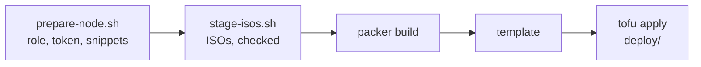

# Proxmox VE templates

Packer builds each template on a Proxmox VE node from its installer ISO, and [`deploy/`](../../deploy/README.md) clones the templates into VMs. This page covers what every Proxmox template shares; [LINUX.md](LINUX.md) and [WINDOWS.md](WINDOWS.md) cover the two families, and each template's README its own values.

| Template | `vm_id` | Installs | Family |
| --- | --- | --- | --- |
| [`ubuntu-24.04-server`](ubuntu-24.04-server/README.md) | 80024 | Ubuntu Server 24.04 LTS | [Linux](LINUX.md) |
| [`ubuntu-26.04-server`](ubuntu-26.04-server/README.md) | 80026 | Ubuntu Server 26.04 LTS | [Linux](LINUX.md) |
| [`ubuntu-26.04-desktop`](ubuntu-26.04-desktop/README.md) | 80126 | Ubuntu Desktop 26.04 LTS | [Linux](LINUX.md) |
| [`kali`](kali/README.md) | 80200 | Kali Linux rolling, `kali-linux-default` and Xfce | [Linux](LINUX.md) |
| [`win-10`](win-10/README.md) | 80310 | Windows 10 Enterprise 22H2, evaluation | [Windows](WINDOWS.md) |
| [`win-11`](win-11/README.md) | 80311 | Windows 11 Enterprise 25H2, evaluation | [Windows](WINDOWS.md) |
| [`win-srv-2025`](win-srv-2025/README.md) | 80325 | Windows Server 2025 Standard, evaluation | [Windows](WINDOWS.md) |

Every template is thin: the base OS, the guest agent, and the agent that configures a clone from its cloud-init drive. A clone that needs more asks for it at first boot - see [`deploy/`](../../deploy/README.md#first-boot-provisioning).

---

## From a bare node to a VM



### 1. Prepare the node, once

[`prepare-node.sh`](../../scripts/proxmox/prepare-node.sh) creates the `automation@pve` user, its `IACDeploy` role and API token, and enables the `snippets` content type. It reads the current state first, so a rerun changes nothing.

```bash
ssh root@pve02 'bash -s -- --dry-run' <scripts/proxmox/prepare-node.sh   # what it would change
ssh root@pve02 'bash -s' <scripts/proxmox/prepare-node.sh                # apply; prints the token secret once
```

### 2. Settings and credentials, once per workstation

```bash
cp templates/proxmox/proxmox.pkrvars.hcl.example templates/proxmox/proxmox.pkrvars.hcl   # node, storage, bridge, SSH key - gitignored
export PKR_VAR_proxmox_api_token_id='automation@pve!deploy'
export PKR_VAR_proxmox_api_token_secret='...'                                             # printed by step 1
ssh-add -l                                                                                # Linux builds log in with this key
```

The token never goes in a file - see [SECURITY.md](../../SECURITY.md). `ssh_authorized_key` in `proxmox.pkrvars.hcl` must be the public half of a key the agent holds; [LINUX.md](LINUX.md#the-seed-and-the-ssh-key) explains why.

### 3. Stage the ISOs

Each template builds from an ISO already on the node (`iso_file`), named as its publisher names it. **Packer never checks a staged ISO** - the plugin skips `iso_checksum` once `iso_file` is set - so [`stage-isos.sh`](../../scripts/proxmox/stage-isos.sh) is that check: it reads each template's own URL and checksum, downloads what is missing, and verifies what is there.

```bash
scripts/proxmox/stage-isos.sh --node root@pve02 --dry-run   # what it would fetch
scripts/proxmox/stage-isos.sh --node root@pve02             # every template
scripts/proxmox/stage-isos.sh --node root@pve02 win-11      # one
```

A file that is already there and fails its check is reported, never overwritten. To have Packer download and check the ISO itself instead, pass `-var 'iso_file='`: it then stores the file under a SHA1 of the URL, and `iso_download_pve`, which would keep the name, needs `Sys.AccessNetwork` - a wider privilege than building a template should require.

### 4. Build

```bash
cd templates/proxmox/<template>
packer init .
packer build -var-file=../proxmox.pkrvars.hcl .   # -on-error=abort keeps a failed VM for inspection
```

Packer refuses a `vm_id` that already exists, so remove the previous template first (`qm destroy <vm_id>` on the node) - and back it up first if a failed build should not leave you without one.

| Override | When |
| --- | --- |
| `-var 'boot_wait=20s'` | the installer never starts: OVMF was still posting when the keys were typed (Linux) |
| `-var 'boot_key_seconds=10'` | Setup stops at "Are you sure you want to quit?" (Windows; raise it if the VM ends at the UEFI shell) |
| `-var 'http_bind_address=<LAN IP>'` | the installer starts but cannot fetch its seed: Packer picked a `docker0` or `virbr0` address (Linux) |
| `-var 'ssh_host=<VM IP>'` | "Waiting for SSH" with nothing reaching the VM: the guest-agent address lookup returned nothing |
| `-var 'vm_id=<id>'` | the default ID is taken on the node |
| `-var 'iso_file=local:iso/<name>.iso'` | the staged ISO has another name |

### 5. Deploy

[`deploy/README.md`](../../deploy/README.md) clones a template into a VM with OpenTofu.

---

## Dedicated role

`prepare-node.sh` gives `automation@pve` this role at `/`, with a token whose privilege separation is off - a separated token starts with no privileges and every call it makes is denied. It is a practical role for building templates and cloning them, not a proven minimum; when something returns `403`, add the one missing privilege rather than switching to `Administrator`.

| Category | Privileges |
| --- | --- |
| Datastore | `Datastore.Allocate`, `Datastore.AllocateSpace`, `Datastore.AllocateTemplate`, `Datastore.Audit` |
| VM | `VM.Allocate`, `VM.Audit`, `VM.Clone`, `VM.Config.CDROM`, `VM.Config.CPU`, `VM.Config.Cloudinit`, `VM.Config.Disk`, `VM.Config.HWType`, `VM.Config.Memory`, `VM.Config.Network`, `VM.Config.Options`, `VM.Console`, `VM.GuestAgent.Audit`, `VM.PowerMgmt` |
| SDN | `SDN.Use` |

- **`VM.GuestAgent.Audit` is the easy one to miss.** Packer asks the guest agent for the VM's address; without it the lookup returns nothing, and the build waits out `ssh_timeout` without a single connection reaching the VM. On PVE 8 it replaced `VM.Monitor`.
- **`Datastore.Allocate`** lets OpenTofu remove a first-boot snippet when it destroys the VM.
- **`Sys.AccessNetwork` is deliberately absent**, which is why ISOs are staged rather than downloaded by the node.

`prepare-node.sh` sets the role back to exactly this list on every run, and prints any difference first.

---

## When the build stops

| Symptom | Look at |
| --- | --- |
| `403` from the API | the role is missing one privilege; the error names it |
| "Waiting for SSH" never ends | `VM.GuestAgent.Audit`, or the guest agent not starting - then `-var 'ssh_host=<VM IP>'` |
| The installer never starts | `boot_wait` (Linux) or `boot_key_seconds` (Windows) |
| The installer cannot fetch its seed | `http_bind_address` |

Family-specific failures are in [LINUX.md](LINUX.md) and [WINDOWS.md](WINDOWS.md#when-the-build-stops).

---

## Verify

```bash
scripts/check-templates.sh proxmox   # fmt, validate and the seeds of these templates
```

---
