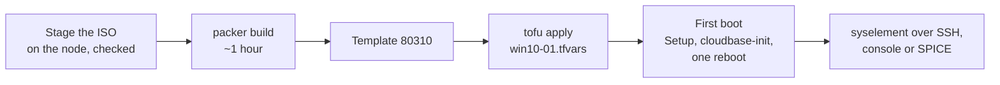

# Windows 10 - Proxmox template

Builds a Windows 10 Enterprise template on Proxmox VE, template 80310.

> **Status: built and cloned on a real node** (22H2 patched to the October 2025 update, ~1 hour).

The media, the build, how a clone configures itself and what to do when the build stops are shared by the three Windows templates and documented once, in [`../WINDOWS.md`](../WINDOWS.md).

## This template

| | |
| --- | --- |
| `vm_id` | 80310 |
| Release | Windows 10 Enterprise 22H2, evaluation |
| `iso_file` | `local:iso/19045.2006.220908-0225.22h2_release_svc_refresh_CLIENTENTERPRISEEVAL_OEMRET_x64FRE_en-us.iso` |
| SHA-256 | `ef7312733a9f5d7d51cfa04ac497671995674ca5e1058d5164d6028f0938d668` |
| `image_index` | 1, Enterprise Evaluation |
| virtio-win folder / Proxmox `os` | `w10` / `win10` |
| Account on a clone | `Administrator`, renamed to `syselement` |

Windows 10 needs neither Secure Boot nor a TPM, but the template keeps both so the three Windows templates stay identical everywhere else.

Windows 10 reached end of support in October 2025. It is here for the lab, not as something to put on a network.

## From nothing to a running VM



**0. Once.** The tools, the API token and `proxmox.pkrvars.hcl`, as in [`../WINDOWS.md`](../WINDOWS.md).

**1. Stage the ISO, on the node.** Packer never checks a staged ISO, so this `sha256sum -c` is the only check it gets:

```bash
cd /var/lib/vz/template/iso
wget "https://software-static.download.prss.microsoft.com/dbazure/988969d5-f34g-4e03-ac9d-1f9786c66750/19045.2006.220908-0225.22h2_release_svc_refresh_CLIENTENTERPRISEEVAL_OEMRET_x64FRE_en-us.iso"
echo "ef7312733a9f5d7d51cfa04ac497671995674ca5e1058d5164d6028f0938d668  19045.2006.220908-0225.22h2_release_svc_refresh_CLIENTENTERPRISEEVAL_OEMRET_x64FRE_en-us.iso" | sha256sum -c
```

**2. Build the template, on the workstation.** `vm_id` 80310 must be free - `qm destroy 80310` an old template first:

```bash
cd templates/proxmox/win-10
export PKR_VAR_proxmox_api_token_id="automation@pve!deploy"
export PKR_VAR_proxmox_api_token_secret="xxxxxxxx-xxxx-xxxx-xxxx-xxxxxxxxxxxx"
packer init .
packer build -on-error=abort -var-file=../proxmox.pkrvars.hcl .
```

It installs Windows, loops Windows Update until nothing is left, installs cloudbase-init, runs sysprep and converts the VM into template 80310. `-on-error=abort` keeps a failed VM for inspection instead of deleting it.

**3. Deploy a VM with OpenTofu.** One map entry per VM, in a gitignored tfvars file - `deploy/lab.tfvars.example` has this one:

```hcl
"win10-01" = {
  template_vm_id = 80310
  cores          = 4
  memory         = 4096
  disk_size      = 64      # never below the template's 64G
  tags           = ["opentofu", "windows"]
}
```

```bash
cd deploy
export PROXMOX_VE_API_TOKEN='automation@pve!deploy=xxxxxxxx-...'
export TF_VAR_password='...'          # any password
tofu init
tofu workspace select win10-01 || tofu workspace new win10-01
tofu apply -var-file=win10-01.tfvars
```

Leave `provisioning_steps` unset: the 02/03 scripts are Ubuntu's.

**4. First boot.** Windows Setup finishes, `SetupComplete.cmd` starts cloudbase-init, and cloudbase-init renames `Administrator` to `syselement` and sets its password and SSH key, the hostname and the disk size from the cloud-init drive, then reboots once. Give it a few minutes before logging in:

```bash
ssh syselement@<address>        # the key; the password works on the console
```

The display is SPICE (`qxl`): open it with `remote-viewer` or `cv4pve-vdi` for clipboard sharing and resizing, through the SPICE agent the virtio-win guest tools install.

**5. Remove it.** `tofu destroy -var-file=win10-01.tfvars` in the same workspace.

## Other Windows 10 media

Microsoft's download server still serves the 22H2 evaluation above, despite end of support. Any other Windows 10 ISO works with `-var 'iso_file=local:iso/<name>.iso'`, `image_index` set to the edition you want, and `product_key` if it needs one.
