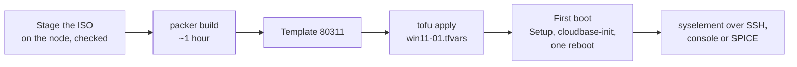

# Windows 11 - Proxmox template

Builds a Windows 11 Enterprise template on Proxmox VE, template 80311.

> **Status: built and cloned on a real node** (25H2, ~1 hour, most of it Windows Update). The clone came up with its hostname, account, password and SSH key from the cloud-init drive, `C:` grown to the disk, dark mode, and fully patched.

The media, the build, how a clone configures itself and what to do when the build stops are shared by the three Windows templates and documented once, in [`../WINDOWS.md`](../WINDOWS.md).

## This template

| | |
| --- | --- |
| `vm_id` | 80311 |
| Release | Windows 11 Enterprise 25H2, evaluation |
| `iso_file` | `local:iso/26200.6584.250915-1905.25h2_ge_release_svc_refresh_CLIENTENTERPRISEEVAL_OEMRET_x64FRE_en-us.iso` |
| SHA-256 | `a61adeab895ef5a4db436e0a7011c92a2ff17bb0357f58b13bbc4062e535e7b9` |
| `image_index` | 1, Enterprise Evaluation |
| virtio-win folder / Proxmox `os` | `w11` / `win11` |
| Account on a clone | `Administrator`, renamed to `syselement` |

Windows 11 needs Secure Boot, a TPM 2.0, 4 GB of memory and a 64 GB disk, and the template has exactly that. It would also encrypt `C:` on its own, which sysprep refuses; the answer file switches that off.

## From nothing to a running VM



**0. Once.** The tools, the API token and `proxmox.pkrvars.hcl`, as in [`../WINDOWS.md`](../WINDOWS.md).

**1. Stage the ISO, on the node.** Packer never checks a staged ISO, so this `sha256sum -c` is the only check it gets:

```bash
cd /var/lib/vz/template/iso
wget "https://software-static.download.prss.microsoft.com/dbazure/888969d5-f34g-4e03-ac9d-1f9786c66749/26200.6584.250915-1905.25h2_ge_release_svc_refresh_CLIENTENTERPRISEEVAL_OEMRET_x64FRE_en-us.iso"
echo "a61adeab895ef5a4db436e0a7011c92a2ff17bb0357f58b13bbc4062e535e7b9  26200.6584.250915-1905.25h2_ge_release_svc_refresh_CLIENTENTERPRISEEVAL_OEMRET_x64FRE_en-us.iso" | sha256sum -c
```

**2. Build the template, on the workstation.** `vm_id` 80311 must be free - `qm destroy 80311` an old template first:

```bash
cd templates/proxmox/win-11
export PKR_VAR_proxmox_api_token_id="automation@pve!deploy"
export PKR_VAR_proxmox_api_token_secret="xxxxxxxx-xxxx-xxxx-xxxx-xxxxxxxxxxxx"
packer init .
packer build -on-error=abort -var-file=../proxmox.pkrvars.hcl .
```

It installs Windows, loops Windows Update until nothing is left, installs cloudbase-init, runs sysprep and converts the VM into template 80311. `-on-error=abort` keeps a failed VM for inspection instead of deleting it.

**3. Deploy a VM with OpenTofu.** One map entry per VM, in a gitignored tfvars file - `deploy/lab.tfvars.example` has this one:

```hcl
"win11-01" = {
  template_vm_id = 80311
  cores          = 4
  memory         = 4096
  disk_size      = 64      # never below the template's 64G
  tags           = ["opentofu", "windows"]
}
```

```bash
cd deploy
export PROXMOX_VE_API_TOKEN='automation@pve!deploy=xxxxxxxx-...'
export TF_VAR_password='...'          # any password
tofu init
tofu workspace select win11-01 || tofu workspace new win11-01
tofu apply -var-file=win11-01.tfvars
```

Leave `provisioning_steps` unset: the 02/03 scripts are Ubuntu's.

**4. First boot.** Windows Setup finishes, `SetupComplete.cmd` starts cloudbase-init, and cloudbase-init renames `Administrator` to `syselement` and sets its password and SSH key, the hostname and the disk size from the cloud-init drive, then reboots once. Give it a few minutes before logging in:

```bash
ssh syselement@<address>        # the key; the password works on the console
```

The display is SPICE (`qxl`): open it with `remote-viewer` or `cv4pve-vdi` for clipboard sharing and resizing, through the SPICE agent the virtio-win guest tools install.

**5. Remove it.** `tofu destroy -var-file=win11-01.tfvars` in the same workspace.
