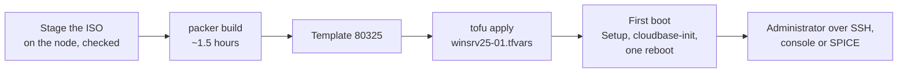

# Windows Server 2025 - Proxmox template

Builds a Windows Server 2025 Standard (Desktop Experience) template on Proxmox VE, template 80325.

> **Status: built and cloned on a real node** (patched to 26100.33438, ~1.5 hours).

The media, the build, how a clone configures itself and what to do when the build stops are shared by the three Windows templates and documented once, in [`../WINDOWS.md`](../WINDOWS.md).

## This template

| | |
| --- | --- |
| `vm_id` | 80325 |
| Release | Windows Server 2025 Standard, evaluation, Desktop Experience |
| `iso_file` | `local:iso/26100.1742.240906-0331.ge_release_svc_refresh_SERVER_EVAL_x64FRE_en-us.iso` |
| SHA-256 | `d0ef4502e350e3c6c53c15b1b3020d38a5ded011bf04998e950720ac8579b23d` |
| `image_index` | 2, Standard Evaluation (Desktop Experience) |
| virtio-win folder / Proxmox `os` | `2k25` / `win11` - it covers Server 2022 and 2025 too |
| Account on a clone | `Administrator`, kept |

The ISO, its URL, its checksum and `image_index = 2` are all taken from [`../../vmware/win-srv-2025/`](../../vmware/win-srv-2025/), which already builds from that ISO on real hardware.

**The account stays `Administrator`.** cloudbase-init manages it under that name and does not rename it, and the SSH key goes to `C:\Users\Administrator\.ssh\authorized_keys`. Without a password on the cloud-init drive, it gets a random one, exactly as the client templates do.

**The clone's password must meet Server's complexity rule.** Server enforces it and Windows 10 and 11 do not: at least three of upper case, lower case, digits and symbols. cloudbase-init sets `cipassword` through the normal account API, so a simple one such as `packer` is refused and `Administrator` keeps the random password - the SSH key still works, which makes it easy to miss. The build itself can use `packer` only because Setup's answer file is exempt from the rule. Use a complex one, in `qm set --cipassword` and in `TF_VAR_password` for a Server VM in `deploy/`:

```bash
qm set <vmid> --cipassword 'Lab-Passw0rd!'
```

Changing it on an existing clone takes a reboot: the new password gives the cloud-init drive a new identity, and cloudbase-init applies it as a new instance.

OpenSSH Server ships with Server 2025, so its first logon only switches it on rather than downloading it.

## From nothing to a running VM



**0. Once.** The tools, the API token and `proxmox.pkrvars.hcl`, as in [`../WINDOWS.md`](../WINDOWS.md).

**1. Stage the ISO, on the node.** Packer never checks a staged ISO, so this `sha256sum -c` is the only check it gets:

```bash
cd /var/lib/vz/template/iso
wget "https://software-static.download.prss.microsoft.com/dbazure/888969d5-f34g-4e03-ac9d-1f9786c66749/26100.1742.240906-0331.ge_release_svc_refresh_SERVER_EVAL_x64FRE_en-us.iso"
echo "d0ef4502e350e3c6c53c15b1b3020d38a5ded011bf04998e950720ac8579b23d  26100.1742.240906-0331.ge_release_svc_refresh_SERVER_EVAL_x64FRE_en-us.iso" | sha256sum -c
```

**2. Build the template, on the workstation.** `vm_id` 80325 must be free - `qm destroy 80325` an old template first:

```bash
cd templates/proxmox/win-srv-2025
export PKR_VAR_proxmox_api_token_id="automation@pve!deploy"
export PKR_VAR_proxmox_api_token_secret="xxxxxxxx-xxxx-xxxx-xxxx-xxxxxxxxxxxx"
packer init .
packer build -on-error=abort -var-file=../proxmox.pkrvars.hcl .
```

It installs Windows, loops Windows Update until nothing is left, installs cloudbase-init, runs sysprep and converts the VM into template 80325. `-on-error=abort` keeps a failed VM for inspection instead of deleting it.

**3. Deploy a VM with OpenTofu.** One map entry per VM, in a gitignored tfvars file - `deploy/lab.tfvars.example` has this one:

```hcl
"winsrv25-01" = {
  template_vm_id = 80325
  username       = "Administrator"   # Server keeps the built-in account
  cores          = 4
  memory         = 4096
  disk_size      = 64      # never below the template's 64G
  tags           = ["opentofu", "windows"]
}
```

```bash
cd deploy
export PROXMOX_VE_API_TOKEN='automation@pve!deploy=xxxxxxxx-...'
export TF_VAR_password='...'          # complex: three of upper, lower, digits, symbols
tofu init
tofu workspace select winsrv25-01 || tofu workspace new winsrv25-01
tofu apply -var-file=winsrv25-01.tfvars
```

Leave `provisioning_steps` unset: the 02/03 scripts are Ubuntu's.

**4. First boot.** Windows Setup finishes, `SetupComplete.cmd` starts cloudbase-init, and cloudbase-init sets `Administrator`'s password and SSH key, the hostname and the disk size from the cloud-init drive, then reboots once. Give it a few minutes before logging in:

```bash
ssh Administrator@<address>        # the key; the password works on the console
```

The display is SPICE (`qxl`): open it with `remote-viewer` or `cv4pve-vdi` for clipboard sharing and resizing, through the SPICE agent the virtio-win guest tools install.

**5. Remove it.** `tofu destroy -var-file=winsrv25-01.tfvars` in the same workspace.
